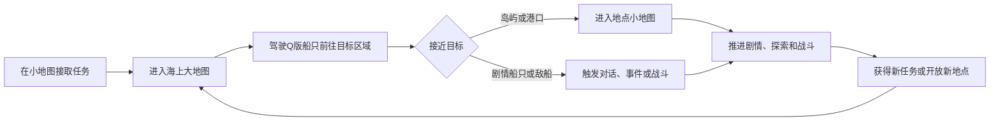

# 《厂车英雄传》海上大地图设计方案

- 状态：初版已实现
- 版本：1.4
- 当前阶段：初版交互原型
- 参考体验：《逸剑风云决》《侠客风云传前传》的大地图区域连接与探索
- 地理原型：中国广东海岸线

## 1. 设计目标

制作一套轻量化的海上大地图系统。玩家以Q版人物乘船的形象在广东海岸原型地图上移动，往返港口、岛屿、海峡和不同海域；接近可进入地点后切换到对应的小地图，继续剧情探索、NPC交互和战斗。

海上大地图不是游戏的主要玩法，也不承担航海模拟职责。它的核心作用是：

1. 把分散的港口、岛屿和剧情区域组织成一个有空间关系的世界。
2. 让玩家亲自驾驶Q版船只往返，而不是只通过菜单选择关卡。
3. 展示广东海岸由西向东的地域变化和故事推进过程。
4. 提供少量发现感、路线选择和世界事件，但不抢占小地图剧情与战斗的比重。

### 1.1 当前初版目标

当前只验证海上大地图最基础的操作与交互闭环：

1. 玩家可以使用WASD或方向键控制Q版船只在大地图上移动。
2. 玩家靠近地点后，地点名称高亮并出现“进入”按钮。
3. 玩家点击“进入”按钮或按E后，界面提示“该地点即将开放”。
4. 玩家接触海上事件或船只后自动触发提示，显示“该事件开发中”或“该船只开发中”。

当前初版不切换岛屿小地图、不播放剧情、不进入战斗，也不实现完整海图、快速移动、区域解锁和潮汐通道逻辑。这些内容只作为后续方向保留在本文档中。

### 1.2 当前实现

- 独立场景：`res://scenes/sea_overworld/sea_overworld.tscn`
- 场景逻辑：`res://scripts/sea_overworld.gd`
- 船只移动与动画：`res://scripts/sea_overworld_player.gd`
- 针对性测试：`res://tests/test_sea_overworld.gd`
- 运行方式：在Godot编辑器中打开海上大地图场景并运行当前场景，或使用Godot命令行直接运行该场景。

当前基础图包含四个地点、两艘自动触发船只和一个漂流事件；加上东部扩展后共有七个可进入地点。

东部扩展采用第二张同规格背景分块接在原海图右侧，通过纯海水重叠带形成连续航行空间；扩展后保留原有四地点，并新增红湾卫所、南澳商港和东极秘岛。B 区只保留三个主岛，以大面积开阔海水强化远航感；新增地点暂时复用旧地点进入流程，主动点击或按 E 后只显示“该岛屿即将开放”。

C 区作为第三张同规格分块放在 A 区正下方，其右侧预留 D 区，左侧没有相邻分块。C 区新增澄海灯岛、龙门海寨、白沙渔岛与玄潮古屿四个主岛。四岛靠左与中部以不规则折线群岛链分布，不使用四角、对齐行列或等距布局；各段岛距有远有近，最近两岛之间仍保留宽航道。C 区顶部保留纯海水与 A 区底部融合，右侧保留远洋空白作为 D 区接口；进入交互继续使用“该岛屿即将开放”占位反馈。

## 2. 明确的系统边界

### 2.1 需要保留

- Q版船只在海面上的自由移动。
- 港口、岛屿、水寨、秘境等地点的发现与进入。
- 广东海岸线的整体轮廓和由西向东的区域关系。
- 海峡等具有辨识度的地图通道。
- 少量潮汐通道，用于支线、秘境或阶段性捷径。
- 可见的剧情船只、敌船、漂流物和其他轻量事件。
- 已发现地点、任务目标和区域出口的海图标记。
- 通过主线剧情逐步开放新海域。

### 2.2 不制作

- 风向系统。
- 浓雾系统。
- 浅滩与吃水深度系统。
- 暗礁碰撞与船体损伤系统。
- 洋流加减速系统。
- 风暴区和持续航行消耗。
- 巡航、慢航、停泊等多档航行模式。
- 复杂的补给、船员值班或拟真航海操作。
- 依靠航海装备才能通过普通区域的硬性能力门槛。

除剧情明确需要外，玩家在海上移动时不应因为环境系统被迫减速、绕路或反复整备。

## 3. 核心体验循环

推荐时间占比：

| 内容 | 建议占比 |
|---|---:|
| 小地图剧情、探索和NPC交互 | 50%～60% |
| 小地图战斗及海战关卡 | 25%～35% |
| 海上大地图移动与发现 | 10%～15% |

一次普通跨区域航行应控制在30秒至2分钟。已经多次往返的长航线可开放快速移动，避免重复赶路。

## 4. 世界地图结构

### 4.1 地理处理原则

地图以广东海岸线为原型，但不按真实距离和比例制作。应压缩漫长的直线海岸、放大岛群和海峡，并让重要地点在视觉上更醒目。

可以保留广州、雷州、潮州、南澳等具有地域识别度的名称，也可以把具体港口和岛屿架空化，以便剧情、势力和历史背景自由创作。

### 4.2 海域分区

| 海域 | 地图作用 | 内容方向 |
|---|---|---|
| 雷州外海 | 西部边界或中后期区域 | 军港、海盗据点、火山岛、远洋来客 |
| 阳江海域 | 前中期过渡区 | 渔村、沉船、地方帮派、沿岸小城 |
| 川山群岛 | 岛屿密集的探索区 | 水寨、藏宝岛、商路、较多支线入口 |
| 珠江口 | 世界中心和主要交通枢纽 | 大型港城、官府、商会、水师与主线势力 |
| 大亚湾 | 山海相接的剧情区 | 军寨、秘密港口、珍珠场、隐藏门派 |
| 红海湾 | 中后期冲突区 | 敌对势力、追击事件、关键海峡 |
| 潮汕与南澳 | 东部终局或远洋出口 | 大型岛屿、商贸港、终章剧情和远洋航线 |

首版不必同时开放全部区域。各海域可以由主线章节逐步解锁，地图边界使用关卡、封锁线、剧情提示或尚未取得的航路情报自然限制。

当前 B 区东部扩展先落地红海湾至潮汕与南澳方向，以独立背景分块增加卫所、商港与秘境岛；分块西侧以开阔海水接入旧图，三个大型主岛不得压住接缝或形成无法绕行的封闭航道。

## 5. 大地图移动设计

### 5.1 操作方式

- 仅使用WASD或方向键控制船只移动，不支持鼠标点击移动；鼠标只用于操作地点按钮等界面元素。
- 船只可以有轻微转向动画，但输入响应应接近普通RPG角色，不模拟真实船舶惯性。
- 松开移动键后立即或极短时间内停下。
- 靠近可进入地点时保持当前航行速度，不自动减速。
- 玩家不需要切换航速，也不需要手动抛锚或停泊。
- 船只被地图边界、岛屿海岸和不可通行区域阻挡，但碰撞不产生耐久损失。

### 5.2 视觉表现

- 船上显示玩家Q版形象，重要同伴可在甲板上以小比例出现。
- 船帆或旗帜体现玩家所属势力，也可随剧情阶段更换。
- 船只航行时显示简洁尾浪，转向时表现船体倾斜或帆面变化。
- 海面可以有纯视觉性的波纹、飞鸟、鱼群和远处帆影，但不影响数值和操作。
- 镜头采用2.5D俯视斜角，保证岛屿轮廓和入口容易辨认。
- 航行时间以 29.5 天朔望月表达：船只实际移动时每 2 秒推进 1 个游戏日，约 59 秒完成一个月相周期；静止或打开菜单、任务和完整海图时暂停推进。
- 月相只承担长途航行的时间感与氛围反馈，不影响潮汐、遭遇、移动速度、剧情门控或战斗数值。

## 6. 地点与入口设计

### 6.1 地点类型

| 类型 | 功能 | 进入后的主要内容 |
|---|---|---|
| 大型港城 | 主线枢纽 | 大量NPC、商店、官府、门派、船坞和连续剧情 |
| 港口聚落 | 区域节点 | 渔村、水寨、军营、盐场、商站和支线任务 |
| 剧情岛屿 | 章节舞台 | 剧情探索、机关、首领战和重要选择 |
| 荒岛秘境 | 可选探索 | 宝箱、洞窟、遗迹、采集和精英敌人 |
| 海上目标 | 临时事件 | 剧情船、商船、敌船、漂流物和任务交互 |

不是每一块礁石和小岛都可以进入。可进入地点应通过码头、炊烟、旗帜、建筑灯火、沙滩缺口或任务光标形成统一的视觉语言。

### 6.2 当前初版进入流程

1. 玩家驶入地点的近岸触发范围。
2. 地点名称高亮显示，并在名称旁出现“进入”按钮；船只保持当前航行速度。
3. 玩家可以点击“进入”按钮或按E进入；直接驶离触发范围则关闭提示。
4. 界面弹出“【地点名称】即将开放”提示。
5. 关闭提示后继续停留在海上大地图，不切换场景。

提示只在玩家主动点击按钮或按E时出现，靠近地点本身不自动弹窗。完整版本再加入靠岸转场、小地图切换和离岛返回流程。

东部扩展地点沿用同一流程，但占位文案统一为“【地点名称】· 该岛屿即将开放”，用于明确当前交互目标是新增岛屿或港口入口。

## 7. 海峡与潮汐通道

### 7.1 海峡

海峡是大地图中少量具有路线意义的结构，主要承担以下职责：

- 连接两个海域或岛群。
- 聚集商船、官船、海盗或剧情拦截事件。
- 作为章节边界和区域辨识点。
- 让地图形成通道、开阔海面和岛群之间的节奏变化。

海峡不附带复杂航行操作，玩家只需正常驶过。

### 7.2 潮汐通道

潮汐通道用于隐藏内容和有限的路线变化，不发展为完整潮汐模拟系统。

推荐规则：

- 通道只设置在少数支线岛屿、隐藏港口或捷径处。
- 当前是否开放由地图上的水位和入口提示直接表现。
- 玩家不需要原地等待，可以先进行其他任务，或通过附近NPC获得开放时段线索。
- 主线必经路线不应被实时潮汐长时间阻断。
- 完成相关剧情后，可以将潮汐捷径永久开放。

## 8. 海上事件与船只

海上事件应当数量有限、目标明确，并尽量服务剧情，而不是成为随机刷取玩法。

### 8.1 推荐事件

- 主线人物乘船出现并触发对话。
- 敌方船只封锁某处海峡。
- 商船或渔船发出求救信号。
- 漂流木箱、瓶中信或船骸提供支线线索。
- 海盗船发现玩家后进行短距离追击。
- 特定章节出现护送、跟踪或拦截目标。

### 8.2 触发原则

- 普通船只与事件直接显示在地图上。
- 玩家驶入事件或船只的触发范围后自动触发，不需要按E。
- 同一次接触只触发一次，避免提示在每一帧重复弹出；玩家驶离后再次进入可重新触发。
- 当前事件统一提示“【事件名称】开发中”。
- 当前船只统一提示“【船只名称】开发中”。
- 关闭提示后继续留在海上大地图，不进入对话、剧情或战斗。
- 不使用高频随机踩雷遇敌。

### 8.3 后续战斗切换

接触敌船后进入独立小地图或战斗关卡：

- 海战使用项目已有的舰船战棋系统。
- 登岛、登船和港口冲突使用角色战斗系统。
- 大地图只负责发现敌人、追逐、接触和结果反馈，不在大地图上展开完整战斗。

## 9. 海图与UI

### 9.1 常驻界面

常驻HUD保持简洁：

- 左上角显示菱形月相时钟，以水墨月面从新月连续变化到满月并完成亏月周期，同时显示当前月相阶段名称。
- 缩小后的菱形海图入口固定在右下角，点击后仍打开完整海图。
- 当前任务目标。
- 附近地点的高亮名称、名称旁的“进入”按钮和按E进入提示。
- 必要时显示剧情敌船或护送目标状态。

不常驻显示风向、补给、潮流、船速档位等航海参数。

### 9.2 完整海图

- 已到访港口显示完整名称和图标。
- 已发现但未进入的岛屿显示问号或地点图标，不绘制岛屿黄色轮廓。
- 主线地点使用醒目标记，支线地点使用较弱标记。
- 海峡、区域边界和已开放航线清晰可见。
- 已完成地点可以保留名称，但弱化任务提示。
- 玩家可以从海图选择已解锁的快速移动地点。

## 10. 解锁与成长

大地图以剧情进度解锁为主，不以复杂船只能力作为通行门槛。

可采用的解锁方式包括：

- 完成章节后获得下一海域的航路情报。
- 取得官府通行文书，通过被封锁的海峡。
- 与商会、渔民或海盗势力建立关系，开放秘密港口。
- 完成支线后永久打开潮汐捷径。
- 发现并进入新港口后解锁快速移动。

船只升级可以影响海战数值、外观和剧情表现，但原则上不应迫使玩家为了普通大地图移动反复刷资源。

## 11. 内容密度与节奏

大地图需要有内容感，但不能让玩家忘记原本要去哪里。

- 新区域入口附近应较快出现第一个可识别地点。
- 相邻主线地点之间通常保持30秒至90秒航程。
- 支线岛屿分布在主航线两侧，使绕行距离可控。
- 同一段航线上同时出现的动态事件不超过1～2个。
- 连续两次跨区往返后，应考虑开放快速移动或剧情跳转。
- 纯装饰岛屿可以增加层次，但不能与可进入地点使用相同提示。

## 12. 当前初版制作范围

当前初版只制作一块用于验证移动和触发交互的海上大地图，不要求完整还原广东海岸，也不制作实际可进入的小地图。

### 12.1 必做内容

- 1张基础海上大地图。
- 1艘玩家Q版船只。
- WASD和方向键移动。
- 若干不可穿越的岛屿或海岸碰撞区域。
- 至少2个地点触发范围。
- 地点名称高亮和名称旁的“进入”按钮。
- 鼠标点击“进入”按钮与按E进入两种操作。
- “【地点名称】即将开放”占位提示。
- 至少1个海上事件和1艘可触发船只。
- “【事件名称】开发中”与“【船只名称】开发中”占位提示。
- 关闭提示后恢复大地图控制。

### 12.2 暂不制作

- 岛屿、港口等地点的小地图。
- 场景切换、靠岸动画和离岛返回。
- 实际剧情、对话和战斗。
- 海战关卡和角色战斗关卡。
- 完整广东海岸区域、海峡和潮汐通道玩法。
- 海图、快速移动、任务追踪和存档进度。
- 船只成长、港口服务及势力解锁。

### 12.3 验收标准

当前初版需要满足：

1. 玩家能够轻松理解Q版船只的移动方式。
2. 玩家只能通过WASD或方向键移动船只，鼠标点击海面不会触发移动。
3. 进入地点触发范围后，地点名称和“进入”按钮正确显示；驶离后正确隐藏。
4. 靠近地点不会自动减速，也不会自动弹出提示。
5. 点击“进入”按钮或按E后，显示对应地点的“即将开放”提示。
6. 接触海上事件或船只后自动显示对应的“开发中”提示，不需要额外按键。
7. 每次进入触发范围只弹出一次提示，不会连续重复弹窗。
8. 关闭任意提示后，玩家能继续正常控制船只移动。

## 13. 总结

本方案中的海上大地图是一张可驾驶、可观察的区域选择地图。玩家通过Q版船只建立“我正在广东沿海航行”的空间感，通过港口、岛屿、海峡和少量潮汐通道发现故事入口；真正的剧情推进、人物互动、探索解谜和战斗仍然集中在小地图中。

后续开发应优先保证移动顺手、入口清晰、场景切换稳定和往返节奏轻快，不应将风向、暗礁、洋流、补给等拟真航海系统重新加入主流程。
