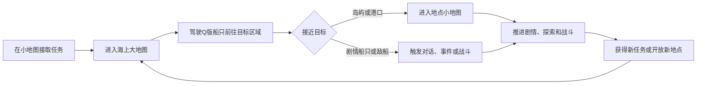

# 《厂车英雄传》海上大地图设计方案

- 状态：生产底图、地点、碰撞、探索迷雾与海上随机事件已接入
- 版本：1.16
- 当前阶段：v4 生产落图、运行时接入与验收已完成
- 参考体验：《逸剑风云决》《侠客风云传前传》的大地图区域连接与探索
- 地理原型：中国广东海岸线

## 1. 设计目标

制作一套轻量化的海上大地图系统。玩家以Q版人物乘船的形象在广东海岸原型地图上移动，往返港口、岛屿、海峡和不同海域；接近可进入地点后切换到对应的小地图，继续剧情探索、NPC交互和战斗。

海上大地图不是游戏的主要玩法，也不承担航海模拟职责。它的核心作用是：

1. 把分散的港口、岛屿和剧情区域组织成一个有空间关系的世界。
2. 让玩家亲自驾驶Q版船只往返，而不是只通过菜单选择关卡。
3. 展示广东海岸由西向东的地域变化和故事推进过程。
4. 提供少量发现感、路线选择和世界事件，但不抢占小地图剧情与战斗的比重。

### 1.1 当前初版目标

当前只验证海上大地图最基础的操作与交互闭环：

1. 玩家可以使用WASD、方向键或左键点击海面控制Q版船只在大地图上移动。
2. 玩家靠近地点后，地点名称高亮并出现“进入”按钮。
3. 玩家点击“进入”按钮或按E后，伏波古岭切换到真实岛屿场景，月环商港切换到正式交易界面；其他地点仍提示“该地点即将开放”。
4. 玩家接触海上事件或船只后自动触发提示，显示“该事件开发中”或“该船只开发中”。

当前初版已为伏波古岭接入真实岛屿小地图与码头返回闭环，并为月环商港接入交易、仓库、图纸和造船界面；其他地点不切换小地图、不播放剧情、不进入战斗。完整海图只负责查看地点与玩家位置，不实现快速移动、区域解锁和潮汐通道逻辑。这些内容只作为后续方向保留在本文档中。

### 1.2 当前实现

- 独立场景：`res://scenes/sea_overworld/sea_overworld.tscn`
- 场景逻辑：`res://scripts/sea_overworld.gd`
- 船只移动与动画：`res://scripts/sea_overworld_player.gd`
- 针对性测试：`res://tests/test_sea_overworld.gd`
- 运行方式：在Godot编辑器中打开海上大地图场景并运行当前场景，或使用Godot命令行直接运行该场景。

当前运行时使用同一张生产母图裁出的 A/B/C/D v3 四分块，并通过 `120` 世界单位重叠带连接成二乘二海域。地图共有 15 个可进入地点、一个固定普通商船目标，以及由茶叶商、私盐商、漂流木箱和雾中海怪组成的三个动态随机事件槽位；进入交互继续复用现有主动点击或按 E 的占位流程。

### 1.3 v4 生产落图状态

右上 B 区为群岛水战区，配置沧门礁堡、月环商港、雾岚群岛、伏波古岭与珊湾渔链五个地点；右下 D 区为敌方核心海域，只配置红湾卫所与倭寇营地两个地点。A 区和 C 区各四个地点，总数为 15；东极秘岛因生产底图中没有独立岛体而删除，四张背景、批准坐标、入口触发、场景二出生点和完整海图资源已完成接入。

生产落图不改变自由航行、主动进入提示、自动事件、月相、存档或场景二往返逻辑。静态碰撞按可见岩岸分组描绘：港池和码头前水面保持开放，中央沉船只作为装饰；A→B、A→C、B→D、C→D 四条跨区路线和中央堡垒四向绕行必须可通。

## 2. 明确的系统边界

### 2.1 需要保留

- Q版船只在海面上的自由移动。
- 港口、岛屿、水寨、秘境等地点的发现与进入。
- 广东海岸线的整体轮廓和由西向东的区域关系。
- 海峡等具有辨识度的地图通道。
- 少量潮汐通道，用于支线、秘境或阶段性捷径。
- 可见的剧情船只、敌船、漂流物和其他轻量事件。
- 已发现地点、任务目标和区域出口的海图标记。
- 通过主线剧情逐步开放新海域。

### 2.2 不制作

- 风向系统。
- 影响航行速度、碰撞或路线判断的天气浓雾系统。海图探索使用的黑色战争迷雾不属于天气系统。
- 浅滩与吃水深度系统。
- 暗礁碰撞与船体损伤系统。
- 洋流加减速系统。
- 风暴区和持续航行消耗。
- 巡航、慢航、停泊等多档航行模式。
- 复杂的补给、船员值班或拟真航海操作。
- 依靠航海装备才能通过普通区域的硬性能力门槛。

除剧情明确需要外，玩家在海上移动时不应因为环境系统被迫减速、绕路或反复整备。

## 3. 核心体验循环

推荐时间占比：

| 内容 | 建议占比 |
|---|---:|
| 小地图剧情、探索和NPC交互 | 50%～60% |
| 小地图战斗及海战关卡 | 25%～35% |
| 海上大地图移动与发现 | 10%～15% |

一次普通跨区域航行应控制在30秒至2分钟。已经多次往返的长航线可开放快速移动，避免重复赶路。

## 4. 世界地图结构

### 4.0 构图优化方向（阶段一灰模）

四张海图继续采用 A/B/C/D 二乘二分块和现有重叠融合方式，但宏观构图统一为“左上出征、双线推进、右下汇合”：

- A 区承担大陆军港、沿岸聚落和近海出征起点，使用一条向东南延伸的碎岛链把视线引向全图中心。
- B 区承担群岛水战空间，五组不同轮廓岛群疏散在右上区域，组织成宽阔主航道、狭窄礁峡和外侧绕行航道。
- C 区承担危险外海，只保留两个高体量地标；另外两个现有地点缩减为沙洲聚落与破碎遗迹岛群，并用暗礁、沉船和狭长岛链增加信息量。
- D 区承担敌方核心海域，红湾卫所与倭寇营地形成“前置要塞—终局敌营”的两层结构，右下大型城塞成为终局视觉地标。
- 当前 15 个地点职责保持稳定；东极秘岛不再占用倭寇营地城塞的同一岛体。

北线为“川山渔村—东湾水寨—沧门礁堡—雾岚群岛—月环商港”，再向南进入 D 区；南线从半圆港湾中的南海军港出发，经“澄海灯岛—龙门海寨—玄潮古屿—红湾卫所”推进。两线最终在 D 区于红湾卫所汇合并抵达倭寇营地。四条分块接缝都必须用岛链、礁石走向或航道开口建立跨区联系，避免出现独立画布感。

阶段一拼接灰模、15 个地点层级、建议世界坐标和接缝约束见 `docs/assets/sea-overworld-stage1-layout.md`。该灰模是下一阶段背景重排依据，不作为运行时地图资源。

#### v3 海域气质与功能造型约束

- 北部 A/B 为繁华贸易海域：港池和仓栈较多、码头密集、航运通道宽而清晰，减少无功能的小礁岛。
- 南部 C/D 为危险蛮荒海域：高山岛、断裂海岸、军事堡垒、海盗据点和礁群较多，航道更曲折，城市建筑明显少于北部。
- 不再为所有城市岛复用“岩石圆底—城墙环—中式建筑群—木码头”的组合。港城使用低平月牙港池与仓栈；堡垒使用棱角海堤、裸岩和单一军港；渔村使用沙洲、红树林、吊脚屋和小栈桥；无人岛使用陡峰、洞穴与破碎海岸且不设码头。
- 主要岛屿与当前 15 个地点数量保持不变。岛链采用“密—疏—空—密”的分组节奏，不使用等间距串珠式引导。
- 全图中央只允许加入 3～5 个微型礁石和一艘沉船作为视觉信息，必须保留宽阔通航水面。
- B 区在五个既有地点不变的前提下减少约一半装饰礁点，并形成一条宽阔、干净、容易辨认的北部航运通道。

#### v4 中央留白与右上地标层级约束

- B 区既有的棱角型海防堡垒向左下迁移到中央偏右、仍位于水平中线以上的海面，作为北线从繁华海域进入中央水门前的门户；不得增加新的主要地点。
- 右上建筑密集区不再并列三个同级大型地标。月牙商港作为主地标，狭长贸易岛作为次地标，小渔村和自然岛保持低视觉权重。
- 月牙商港保持原位置与体量，但港湾开口和主要码头统一朝左，使其视觉动势指向中央偏右的海防堡垒。
- 迁移后的堡垒与中央沉船、自然山岛之间保留明显水面间隔，不堵塞东西和南北航向；原堡垒位置恢复为干净海水。
- v4 只调整沧门礁堡的位置，其他 15 个地点、中央沉船、微型礁石、功能轮廓和南北海域差异保持 v3 状态。

#### v4 生产四分块规格

- 生产母图尺寸固定为 `6528×3604`，作为接缝一致性的单一美术来源；母图和生成中间稿保存在仓库外，不作为运行时资源。
- A/B/C/D 四张运行时分块均为 `3344×1882` 源像素，在场景内继续以 `0.75` 缩放显示为约 `2508×1412` 世界单位。
- 横向和纵向相邻分块共享 `160` 源像素重叠带，对应当前 `120` 世界单位重叠；运行时原点保持 A `(0,0)`、B `(2388,0)`、C `(0,1292)`、D `(2388,1292)`。
- 分块裁剪原点固定为 A `(0,0)`、B `(3184,0)`、C `(0,1722)`、D `(3184,1722)`，不得分别重绘接缝内容。
- 地点数量固定为 A4、B5、C4、D2。生产落图时地点中心相对批准草案只允许 `±80` 世界单位调整，入口触发必须对准最终画面中的可见码头或登陆口。
- 当前资源固定使用 `guangdong_sea_zone_[a-d]_v3.png`，构图参考只保留 v4 灰模。

### 4.1 地理处理原则

地图以广东海岸线为原型，但不按真实距离和比例制作。应压缩漫长的直线海岸、放大岛群和海峡，并让重要地点在视觉上更醒目。

可以保留广州、雷州、潮州、南澳等具有地域识别度的名称，也可以把具体港口和岛屿架空化，以便剧情、势力和历史背景自由创作。

### 4.2 海域分区

| 海域 | 地图作用 | 内容方向 |
|---|---|---|
| 雷州外海 | 西部边界或中后期区域 | 军港、海盗据点、火山岛、远洋来客 |
| 阳江海域 | 前中期过渡区 | 渔村、沉船、地方帮派、沿岸小城 |
| 川山群岛 | 岛屿密集的探索区 | 水寨、藏宝岛、商路、较多支线入口 |
| 珠江口 | 世界中心和主要交通枢纽 | 大型港城、官府、商会、水师与主线势力 |
| 大亚湾 | 山海相接的剧情区 | 军寨、秘密港口、珍珠场、隐藏门派 |
| 红海湾 | 中后期冲突区 | 敌对势力、追击事件、关键海峡 |
| 潮汕与南澳 | 东部终局或远洋出口 | 大型岛屿、商贸港、终章剧情和远洋航线 |

首版不必同时开放全部区域。各海域可以由主线章节逐步解锁，地图边界使用关卡、封锁线、剧情提示或尚未取得的航路情报自然限制。

当前 B 区东部扩展先落地红海湾至潮汕与南澳方向，以独立背景分块增加卫所、商港与秘境岛；分块西侧以开阔海水接入旧图，三个大型主岛不得压住接缝或形成无法绕行的封闭航道。

## 5. 大地图移动设计

### 5.1 操作方式

- 支持WASD、方向键和左键点击海面控制船只。点击移动采用直线航行，不承担自动绕岛或航线规划；键盘输入会立即取消当前点击目标并接管船只。
- 点击目标到达后自动停船；目标被海岸或岛屿持续阻挡时自动取消。完整海图、菜单、对话、商城或转场锁定输入时不接受点击目标，并清除尚未完成的目标。
- 船只可以有轻微转向动画，但输入响应应接近普通RPG角色，不模拟真实船舶惯性。
- 松开移动键后立即或极短时间内停下。
- 靠近可进入地点时保持当前航行速度，不自动减速。
- 玩家不需要切换航速，也不需要手动抛锚或停泊。
- 船只被地图边界、岛屿海岸和不可通行区域阻挡，但碰撞不产生耐久损失。

### 5.2 视觉表现

- 船上显示玩家Q版形象，重要同伴可在甲板上以小比例出现。
- 生产大地图中玩家船体、航行特效与 Q 版人物采用较小显示比例（船体与特效 `0.28`、人物 `0.088`），避免遮挡附近岛屿和航道，强化海域尺度与开阔感。
- 船只在静止与航行状态间切换时，船体甲板使用一致的视觉锚点；人物保持同一站位，不随状态切换上下跳动或穿入船体。
- 船帆或旗帜体现玩家所属势力，也可随剧情阶段更换。
- 船只航行时显示简洁尾浪，转向时表现船体倾斜或帆面变化。
- 海面可以有纯视觉性的波纹、飞鸟、鱼群和远处帆影，但不影响数值和操作。
- 镜头采用2.5D俯视斜角，保证岛屿轮廓和入口容易辨认。
- 航行时间以 29.5 天朔望月表达：船只实际移动时每 2 秒推进 1 个游戏日，约 59 秒完成一个月相周期；静止或打开菜单、任务和完整海图时暂停推进。
- 月相只承担长途航行的时间感与氛围反馈，不影响潮汐、遭遇、移动速度、剧情门控或战斗数值。

## 6. 地点与入口设计

### 6.1 地点类型

| 类型 | 功能 | 进入后的主要内容 |
|---|---|---|
| 大型港城 | 主线枢纽 | 大量NPC、商店、官府、门派、船坞和连续剧情 |
| 港口聚落 | 区域节点 | 渔村、水寨、军营、盐场、商站和支线任务 |
| 剧情岛屿 | 章节舞台 | 剧情探索、机关、首领战和重要选择 |
| 荒岛秘境 | 可选探索 | 宝箱、洞窟、遗迹、采集和精英敌人 |
| 海上目标 | 临时事件 | 剧情船、商船、敌船、漂流物和任务交互 |

不是每一块礁石和小岛都可以进入。可进入地点应通过码头、炊烟、旗帜、建筑灯火、沙滩缺口或任务光标形成统一的视觉语言。

### 6.2 当前初版进入流程

1. 玩家驶入地点的近岸触发范围。
2. 地点名称高亮显示，并在名称旁出现“进入”按钮；船只保持当前航行速度。
3. 玩家可以点击“进入”按钮或按E进入；直接驶离触发范围则关闭提示。
4. 界面弹出“【地点名称】即将开放”提示。
5. 关闭提示后继续停留在海上大地图，不切换场景。

提示只在玩家主动点击按钮或按E时出现，靠近地点本身不自动弹窗。完整版本再加入靠岸转场、小地图切换和离岛返回流程。

东部扩展地点沿用同一流程，但占位文案统一为“【地点名称】· 该岛屿即将开放”，用于明确当前交互目标是新增岛屿或港口入口。

### 6.3 生产地图入口对位

- 澄海灯岛允许玩家从碰撞轮廓四周多个方向接近并触发，入口点环绕整座灯塔岛分布。
- 倭寇营地只在城塞下方主码头水面提供入口；完整海图与交互提示不再使用“南澳商港”。
- 红湾卫所入口位于岛屿右下方山洞口外的可航行水面。
- 珊湾渔链保留原右下入口，并增加左下入口。
- 伏波古岭只在岛屿东南岸浅滩正前方的可航水面提供入口，不再保留下方的大范围矩形入口或灯塔外礁石入口。
- 雾岚群岛入口位于聚落岛下方的小码头水面。
- 东湾水寨入口位于沙洲岛下方码头水面，不再使用覆盖整片岛前水域的宽入口。

## 7. 海峡与潮汐通道

### 7.1 海峡

海峡是大地图中少量具有路线意义的结构，主要承担以下职责：

- 连接两个海域或岛群。
- 聚集商船、官船、海盗或剧情拦截事件。
- 作为章节边界和区域辨识点。
- 让地图形成通道、开阔海面和岛群之间的节奏变化。

海峡不附带复杂航行操作，玩家只需正常驶过。

### 7.2 潮汐通道

潮汐通道用于隐藏内容和有限的路线变化，不发展为完整潮汐模拟系统。

推荐规则：

- 通道只设置在少数支线岛屿、隐藏港口或捷径处。
- 当前是否开放由地图上的水位和入口提示直接表现。
- 玩家不需要原地等待，可以先进行其他任务，或通过附近NPC获得开放时段线索。
- 主线必经路线不应被实时潮汐长时间阻断。
- 完成相关剧情后，可以将潮汐捷径永久开放。

## 8. 海上事件与船只

海上事件应当数量有限、目标明确，并尽量服务剧情，而不是成为随机刷取玩法。

### 8.1 推荐事件

- 主线人物乘船出现并触发对话。
- 敌方船只封锁某处海峡。
- 商船或渔船发出求救信号。
- 漂流木箱、瓶中信或船骸提供支线线索。
- 海盗船发现玩家后进行短距离追击。
- 特定章节出现护送、跟踪或拦截目标。

### 8.2 触发原则

- 普通船只与事件直接显示在地图上。
- 玩家驶入事件或船只的触发范围后自动触发，不需要按E。
- 同一次接触只触发一次，避免提示在每一帧重复弹出。
- 每个漂流木箱实例都是一次性地图事件：海图只显示无文字的水墨像素木箱素材；玩家接触后停止航行并复用场景二的纸质对话框、士兵立绘和姓名牌。
- 士兵报告发现海上漂流木箱后，玩家选择“打捞上来”或“置之不理”。打捞分支真实获得“铁石 +100、木材 +100、军饷 +1000”；置之不理直接关闭对话并恢复航行。
- 漂流木箱不论选择哪个分支都会移除当前实例，当前实例不能再次触发；同类型可以在后续事件轮换中重新刷新。
- 龙井茶商与私盐商使用纸质选项对话，分别提供交易/拒绝与查扣/受贿/放行分支；结果中的军饷、龙井茶和私盐已接入全局经济仓库。任一分支结束后对应商船移除，单次经济结算仍通过 `GameState` 完成。
- 海图随机事件同时最多出现三个。每次进入海图都重新抽取事件和刷新位置，不沿用上一次海图实例、伏波返航上下文或场景快照中的活动事件；同一种事件在本次海图会话内最多触发一次。任一事件完整结算后，只从本次尚未触发且当前未激活的类型中在玩家当前相机视野外补位；没有新类型时允许槽位自然减少。
- 茶叶商事件的完成状态单独写入全局世界状态并随正式存档保留。尚未完成时，茶叶商与私盐商、漂流木箱和“雾中可疑身影”同等参与普通随机抽取，不固定占槽也不保证出现；完成后从后续海图候选池排除。同一时刻每种事件最多一个实例。
- “雾中可疑身影”在海图上从三张透明背景的浓白雾、低对比淡黑剪影中随机选择一种，并用边缘透明衰减自然融入海面。亮色雾层通过时间驱动的低速噪声产生缓慢漂移和轻微明暗呼吸，暗色海怪剪影保持稳定，避免轮廓扭曲或闪烁；事件只从三片指定宽广深水区中随机落位，并用扩大后的清水半径排除岛屿、礁石，同时保持与其他随机事件的间距，不得回退到岛屿附近。接触前不显示海怪颜色、面部或材质细节。玩家接触后可选择“靠近查看”或“绕行”；靠近才揭示对应的透明背景海怪立绘，并提供“战斗系统尚未接入，此战默认获胜”的占位战斗选项。胜利后显示战胜海怪，真实获得木材 `500`、铁石 `500`；绕行无奖励。
- 私盐商船复用海盗船的间歇巡航节奏：移动 `1.5–3.5` 秒、停驻 `0.8–1.8` 秒并循环，活动范围为刷新点半径 `240` 世界单位；它没有警戒、追逐玩家或追敌返航状态。进入事件对话后暂停巡航。
- 除上述事件外，尚未制作的普通事件继续提示“【事件名称】开发中”。
- 当前船只统一提示“【船只名称】开发中”。
- 事件结束后继续留在海上大地图，不进入战斗或地点小地图。
- 不使用高频随机踩雷遇敌。

### 8.3 后续战斗切换

接触敌船后进入独立小地图或战斗关卡：

- 海战使用项目已有的舰船战棋系统。
- 登岛、登船和港口冲突使用角色战斗系统。
- 大地图只负责发现敌人、追逐、接触和结果反馈，不在大地图上展开完整战斗。

### 8.4 海盗船动态威胁

- 每次进入海图时在可航水面重新随机生成 5 艘海盗船；出生点之间至少间隔 460 像素，并且必须远离南海军港至少 700 像素，避免海盗集中或玩家刚出海便被迫接战。海盗分布不写入存档，离开海图后不保留。
- 海盗船在各自出生点 240 像素范围内间歇巡游：移动 1.5–3.5 秒、停驻 0.8–1.8 秒并循环；静态碰撞阻断巡游时应提前重新选向。
- 主角进入 360 像素警戒范围后，海盗船立即进入持续追逐且不再停驻。主角离开 520 像素脱离范围，或海盗船离自身出生点超过 720 像素追击活动半径时，海盗船停止追逐并进入返航；返航途中忽略玩家警戒，回到出生点后才恢复巡游。警戒、脱离与出生点边界共同避免海盗被长期引离所属海域。
- 海盗船巡游与追逐速度均为 210 像素/秒，低于主角船只的 260 像素/秒，玩家保持航向即可摆脱追逐。
- 海盗船接触主角时进入战斗入口。正式战斗流程未完成前，先锁定海图并显示“海战界面即将开放”提示；确认后移除本次接触的海盗船，避免重复弹出。
- 海盗船使用与主角船只相同的四方向索引（下、左、右、上）和尾流图集，但船体采用黑帆、暗红破布与海盗标记，保持明代岭南海域的像素水墨风格；海盗船体显示缩放为 `0.266`，严格等于玩家船体 `0.28` 缩放的 95%。

## 9. 海图与UI

### 9.1 常驻界面

常驻HUD保持简洁：

- 左上角显示菱形月相时钟，以水墨月面从新月连续变化到满月并完成亏月周期，同时显示当前月相阶段名称。
- 缩小后的菱形海图入口固定在右下角，点击后仍打开完整海图。
- 当前任务目标。
- 附近地点的高亮名称、名称旁的“进入”按钮和按E进入提示。
- 必要时显示剧情敌船或护送目标状态。

不常驻显示风向、补给、潮流、船速档位等航海参数。

### 9.2 完整海图

当前版本使用无文字的水墨像素展开海图作为 UI 背景，标题和返回按钮由 Godot 叠加，A/B/C/D 详细地图放在卷轴中央内框；界面不再保留底部“仅显示可进入地点与玩家当前位置”说明。

右上返回按钮使用透明生成式像素水墨横笔触作为底板，由 Godot 在笔触安全区内居中绘制“返回”二字；不再使用规则长方形金边框。按钮点击范围覆盖完整笔触，同时保留 Esc 与 E 键关闭海图。

海图采用永久探索迷雾。新游戏默认揭示左上大陆完整轮廓，以及南海军港出生点当前相机可见世界矩形；大陆外的未探索海域显示为纯黑。玩家驾驶船只经过时，以当前相机可见世界矩形持续揭示海图，包含屏幕四角和边缘，已经揭示的区域不会重新变黑。航行场景和完整海图必须复用同一份探索数据，不能出现一边已知、一边仍为黑色的状态。

航行场景使用原始探索位图，确保当前相机视野完整点亮；完整海图可以在同一位图上追加仅用于显示的局部 Alpha 平滑，使探索边缘和直角转折略微圆润。视觉柔边不能改变实际探索状态，也不能让未探索地点名称提前出现。

完整海图的柔边允许叠加稳定的低频水墨扰动，使轮廓产生小幅凹凸和错落，避免连续直边仍呈现矩形拼块感。扰动不能随时间变化，也不能在已探索区域内部生成透明孔洞或噪点。

- 已揭示范围内的港口和岛屿显示完整名称；未揭示范围不显示地点名称或图标。
- 玩家当前位置始终显示，且玩家附近会在打开海图前先完成一次完整矩形视野揭示，视野内不得残留黑色边角。
- 主线地点使用醒目标记，支线地点使用较弱标记。
- 海峡、区域边界和已开放航线清晰可见。
- 已完成地点可以保留名称，但弱化任务提示。
- 玩家可以从海图选择已解锁的快速移动地点。

探索进度跨海上大地图、场景二和伏波古岭往返保留，并写入正式单槽存档。新游戏重置运行中的探索位图但不删除磁盘旧存档；旧存档缺少迷雾数据时按“左上大陆与南海军港当前视野已揭示”初始化。已有迷雾存档进入海图时也补充左上大陆初始已知区域。

## 10. 解锁与成长

大地图以剧情进度解锁为主，不以复杂船只能力作为通行门槛。

可采用的解锁方式包括：

- 完成章节后获得下一海域的航路情报。
- 取得官府通行文书，通过被封锁的海峡。
- 与商会、渔民或海盗势力建立关系，开放秘密港口。
- 完成支线后永久打开潮汐捷径。
- 发现并进入新港口后解锁快速移动。

船只升级可以影响海战数值、外观和剧情表现，但原则上不应迫使玩家为了普通大地图移动反复刷资源。

## 11. 内容密度与节奏

大地图需要有内容感，但不能让玩家忘记原本要去哪里。

- 新区域入口附近应较快出现第一个可识别地点。
- 相邻主线地点之间通常保持30秒至90秒航程。
- 支线岛屿分布在主航线两侧，使绕行距离可控。
- 全图同时存在的随机事件固定不超过2个，同一段航线仍以1～2个为上限。
- 连续两次跨区往返后，应考虑开放快速移动或剧情跳转。
- 纯装饰岛屿可以增加层次，但不能与可进入地点使用相同提示。

## 12. 当前初版制作范围

当前初版只制作一块用于验证移动和触发交互的海上大地图，不要求完整还原广东海岸，也不制作实际可进入的小地图。

### 12.1 必做内容

- 1张基础海上大地图。
- 1艘玩家Q版船只。
- WASD和方向键移动。
- 若干不可穿越的岛屿或海岸碰撞区域。
- 至少2个地点触发范围。
- 地点名称高亮和名称旁的“进入”按钮。
- 鼠标点击“进入”按钮与按E进入两种操作。
- “【地点名称】即将开放”占位提示。
- 至少1个海上事件和1艘可触发船只。
- “【事件名称】开发中”与“【船只名称】开发中”占位提示。
- 关闭提示后恢复大地图控制。

### 12.2 暂不制作

- 岛屿、港口等地点的小地图。
- 场景切换、靠岸动画和离岛返回。
- 实际剧情、对话和战斗。
- 海战关卡和角色战斗关卡。
- 完整广东海岸区域、海峡和潮汐通道玩法。
- 快速移动、按区域解锁海图和海图任务筛选。
- 船只成长、港口服务及势力解锁。

### 12.3 验收标准

当前初版需要满足：

1. 玩家能够轻松理解Q版船只的移动方式。
2. 玩家只能通过WASD或方向键移动船只，鼠标点击海面不会触发移动。
3. 进入地点触发范围后，地点名称和“进入”按钮正确显示；驶离后正确隐藏。
4. 靠近地点不会自动减速，也不会自动弹出提示。
5. 点击“进入”按钮或按E后，显示对应地点的“即将开放”提示。
6. 接触海上事件或船只后自动显示对应的“开发中”提示，不需要额外按键。
7. 每次进入触发范围只弹出一次提示，不会连续重复弹窗。
8. 关闭任意提示后，玩家能继续正常控制船只移动。

## 13. 总结

本方案中的海上大地图是一张可驾驶、可观察的区域选择地图。玩家通过Q版船只建立“我正在广东沿海航行”的空间感，通过港口、岛屿、海峡和少量潮汐通道发现故事入口；真正的剧情推进、人物互动、探索解谜和战斗仍然集中在小地图中。

后续开发应优先保证移动顺手、入口清晰、场景切换稳定和往返节奏轻快，不应将风向、暗礁、洋流、补给等拟真航海系统重新加入主流程。
